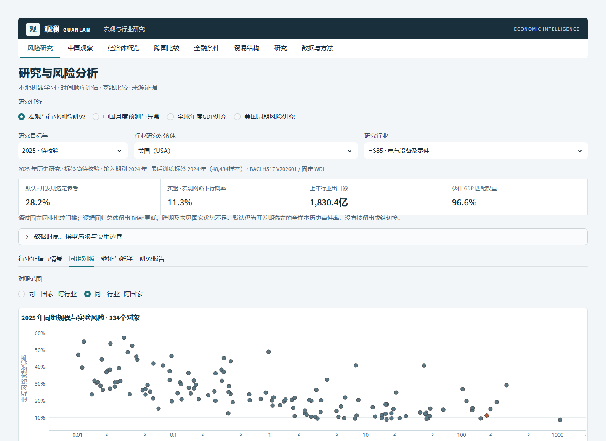
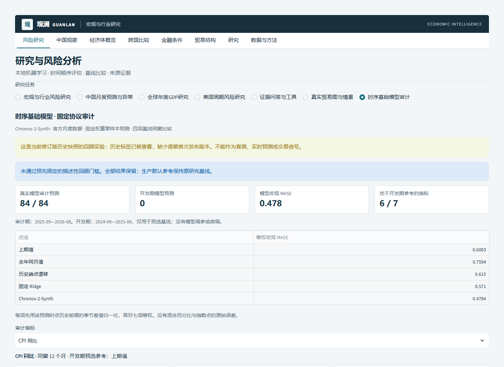
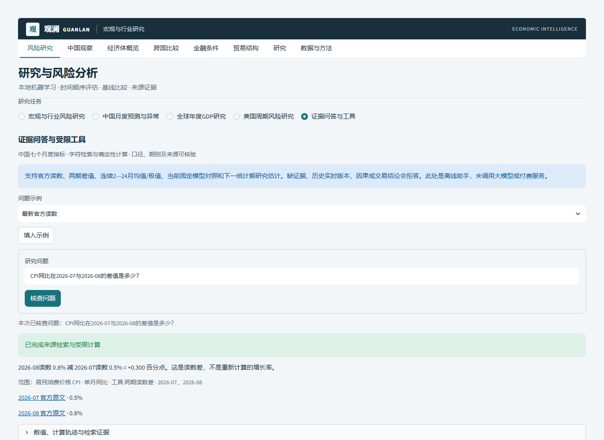
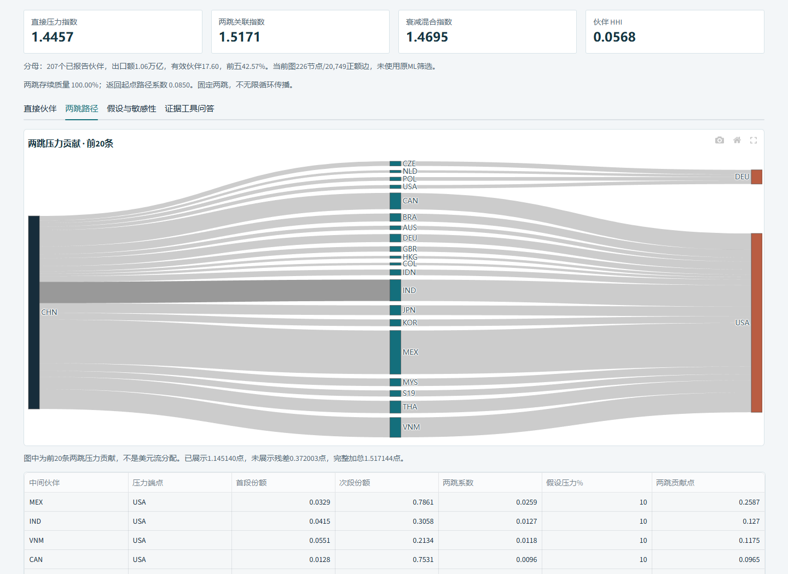
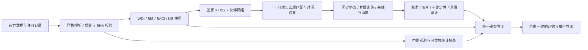

# 观澜 Guanlan · Economic Intelligence

**宏观数据、双边贸易网络与可复核 AI 研究的一体化工作台。**

本项目把全球宏观研究与中国官方月度数据观察整合为同一个系统，并加入真正运行的本地机器学习、国家—行业出口下行研究、伙伴暴露情景、来源证据审计和可离线阅读的报告导出。面向研究人员、国际业务分析人员和需要理解模型局限的人工智能学习者。

定位是**有严格评估记录的研究原型**。数据是当前修订历史快照；模型并未证明可以按当时发布日期实时实施。页面把开发期预定参考、实验模型、失败年度和强对照一起展示，不把聊天生成当作模型训练，不把研究概率当作投资建议。


当前属于开发阶段的专业研究平台；私有仓库发布与 CI 通过均不等同于金融机构生产部署认证。功能验收继续以真实研究工作流、证据和模型局限为准。

## 系统目标与总体验收

工程整合、真实本地机器学习、固定基础模型实验、图计算、证据工具与报告工作流已经建立；预测稳定优势、开放式LLM金融质量、实时版本验证与生产认证分别保留为未通过或未测。首次12题真实LLM受限计划试点已通过，范围见[首测结果](docs/LLM_BUSINESS_PILOT_RESULTS.md)。请先看[目标达成矩阵](docs/OVERALL_ATTAINMENT.md)和[本轮实测验收](docs/OVERALL_ACCEPTANCE.md)，避免把某个阶段的历史测试数或CI当成整体认证。

此前整体工程最终本机 **359项测试＋10子测试**、Ruff、28文件mypy、前端检查、依赖一致性与安全门槛通过；实际Edge **23场景**通过，17张新截图和HTML/JSON/CSV实例保留。模型的未通过结论与开放式金融业务未测边界不因此改变；2026-10-06首测新增实测另行列明。

可直接从“中国观察”把当前指标带入月度研究，再核对官方历史、固定Chronos审计或用原证据工具问答。行业研究按输入年份进入真实贸易图，例如目标2025明确对应输入2024；返回同对象原模型记录时保留已应用压力情景，压力假设不改写模型概率。

## 从一个问题到一份可核查报告

以“中国 HS85 电气设备行业”为例：

1. 在 **风险研究 → 宏观与行业风险研究** 选择研究目标年、经济体和 HS2 行业。**2023、2024 年**为固定历史留出，**2025 年**为标签待核验的历史估计；页面显示输入年份、训练标签截止和实际标签状态。
2. 在“行业证据与情景”核对上一年出口规模、伙伴权重、HHI、前五份额、GDP 匹配覆盖和缺失输入。伙伴金额、覆盖与加权 GDP 必须匹配固定模型输入，混用快照会明确报错。
3. 在“同组对照”切换 **同一国家跨行业 / 同一行业跨国家**，查看所有合格对象的规模与实验估计、模型分歧、当前特征原值与同组中位数／分位。出口份额的分母仅为合格研究样本，不冒充全部出口。
4. 核对所选目标年之前的同行历史事件率、样本数和国家整组抽样区间；它是**训练期历史发生率区间，不是个体预测置信区间**。相同值采用并列中位排序，不包装成模型因果贡献。
5. 在“验证与解释”比较开发期选定参考、宏观网络模型、逻辑回归和仅贸易消融；查看完整固定协议的逐年、国家、行业切片及可靠性图。2023—2024 总体评估是回顾诊断，不进入所选历史年份训练，不用于重新挑选参考。
6. 为一个伙伴设置 GDP 增速百分点冲击，查看按上一年出口权重加权的条件暴露指数。
7. 在“研究报告”连续下载 HTML、JSON、CSV。文件名、目标年、国家—行业、同组范围、训练截止、来源版本和指纹随当前选择保持一致；下载不会重跑服务端或重置当前页签，同组范围切换后也保留页签。

情景指数没有贸易弹性假设，不计算出口损失，也不改变已评估模型概率。2025 年估计使用 2024 年输入；在本项目核验日期它属于待标签核验的历史研究估计，不能称为实时未来预测。若仅缺少待核验年度快照，2023—2024 年历史研究仍可使用；缺少必需特征或数据指纹不一致时明确停止该模块，并允许继续使用其他导航。




## 时序基础模型：实际零样本预测与固定审计

新增“研究与风险分析 → 时序基础模型审计”，展示本机实际运行的 **Chronos-2-Synth**。官方固定权重、118,985,888参数，CPU float32，不微调；7个NBS月度指标、2025-09—2026-08同窗84/84单步预测，开发期只选参考、不运行模型。普通界面读取已验证结果，不需要PyTorch、模型下载或付费API。

七项等权MASE **0.478350**，固定Ridge **0.570978**，6/7项胜过开发期预选参考；但配对描述性95%区间 **[-0.182745, 0.011344]** 仍跨零，**未通过预先固定的研究门槛**。原生80%分位数带覆盖33.3%—91.7%，未事后校准。全部正负结果保留，原应用默认参考和证据助手首测不变；当前修订历史已查看，不称盲测或实时版本验证。

独立D研究环境44个依赖完整哈希/许可/安全核查，原Conda及应用环境未修改；Windows DLL和资源监控修正均在首次经济预测前完成，原记录保留。单次真实审计监督记录约21.73秒，合计峰值工作集0.96GiB，目录约1.48GiB；不是通用性能承诺。

本基础模型阶段的历史验收：345项测试与10个子测试通过，最后展示/重试补充后17项相关回归通过；Ruff、23文件mypy、前端检查、依赖一致性和安全扫描通过，Edge桌面/移动/离线12项通过。完整报告和失败勘误均保留，最终提交CI另行核对。



[完整方法、指标、局限及复现](docs/CHRONOS_SYNTH_ACCEPTANCE.md) · [直接打开离线报告](assets/demo/chronos-synth-v1/chronos-synth-audit.html) · [可重算JSON](assets/demo/chronos-synth-v1/chronos-synth-audit.json) · [独立研究环境复现](research/chronos/REPRODUCE.md)

离线verifier仅重算保存预测的指标及固定基线，不独立证明真实模型执行；执行证据依赖冻结代码、哈希与唯一运行日志。真实模型仅Windows跑过，Linux应用CI不代表Linux模型执行已测。

```powershell
.\.venv\Scripts\python.exe scripts/verify_chronos_report.py assets/demo/chronos-synth-v1/chronos-synth-audit.json
.\.venv\Scripts\python.exe scripts/check_chronos_evidence.py
```

## 中国月度研究：证据约束闭环

在 **风险研究 → 中国月度预测与异常** 选择七个已定义指标之一，再选“上个自然月／去年同月”。月度核验单把官方读数、同口径百分点差、固定回测、默认基线、下一统计期实验估计、异常提示和局限分别标记；每条声明带官方观察或本地模型证据依赖。

Ridge 与 IsolationForest 是实际运行的本地机器学习；解释文字是确定性模板，**不是大模型经济判断**。七个指标的 Ridge 固定门槛失败结论保留，默认参考仍为开发期选定的基线。经验带明确属于 Ridge，不混作基线区间；缺自然月拒绝插值或以最近记录代替。

连续下载 **核验单 HTML／核验包 JSON／声明与证据 CSV**；文件名绑定指标、期别、比较范围和核验指纹。JSON包含同一份来源记录、完整逐月回测、模型结果、声明和编排。使用锁定环境离线重算：

```powershell
python scripts/verify_monthly_review.py path/to/monthly-review.json
python scripts/evaluate_monthly_review.py
python -m pytest -q tests/test_monthly_review.py tests/test_monthly_review_ui.py
```

可下载受限编排示例并重新导入。导入内容只能选择／排序已核验声明ID，不能写入新数字、正文、来源或任意工具；最新读数、方法决策及局限不可隐藏。过期／矛盾／越权计划拒绝后继续展示当前本地核验单。可选 `generate_review_plan` 的API适配仅以mock验证，未接入付费UI按钮；真实编排质量与费用需另行授权和评估，既有单次测试预算不延续。助手不读取密钥文件或建立持久凭据。

SHA256与离线重算用于一致性核验，**不是来源真实性数字签名**。复算会重跑固定模型；单纯重新计算篡改文件的SHA仍不能通过。[本阶段实测验收](docs/MONTHLY_REVIEW_ACCEPTANCE.md)与[预定协议](docs/MONTHLY_REVIEW_PROTOCOL.md)明确区分29例工程任务与尚未开展的语言模型商业质量评测；[阶段路线](ROADMAP.md)说明后续研究范围。

## 问题驱动的证据检索与工具问答

进入 **风险研究 → 证据问答与工具**，输入例如“CPI同比在2026-07与2026-08的差值是多少？”或“制造业PMI在2025-01到2025-06的最低值与并列月份是什么？”。系统显式核对中国、指标口径和自然月范围，检索批准出处，运行六类工具，展示数字、原文链接和计算轨迹；没有证据或范围不清时拒答/要求澄清。

支持七个既有月度指标的单期/最新读数、两期差、完整2—24月均值/极值、固定回测与基线、下一期研究估计。连续下载HTML/JSON/CSV，未提交的新文字不会改写此前已完成答复。数字由本地工具算；当前层是字符TF-IDF与确定性工具，**没有调用生成式LLM**。

首轮150个封存程序病例：正确144/150（96%），应答覆盖72/78（92.3%），已答数值/引用支持72/72，应拒答72/72；关键词对照正确102/150。六项“谷值”表述被错误澄清，原始失败保留，冻结后未修正重测。任务正确Wilson95%为[91.55%,98.15%]，分族区间[88%,100%]；这些不是预测准确率、真实用户总体或大模型质量。



[完整协议与实测限制](docs/ASSISTANT_ACCEPTANCE.md) · [可离线打开的报告](assets/demo/assistant-cpi/cpi-difference.html) · [可重算JSON](assets/demo/assistant-cpi/cpi-difference.json) · [LLM受限业务首测（12题通过）](docs/LLM_BUSINESS_PILOT.md)

```powershell
python scripts/verify_assistant_report.py assets/demo/assistant-cpi/cpi-difference.json
python -m pytest -q tests/test_evidence_assistant.py tests/test_evidence_assistant_ui.py
```

## 真实贸易图：从出口伙伴到两跳市场关联

在 **风险研究→真实贸易图与情景**，或 **证据问答与工具→真实贸易图** 选择统计年、出口国、HS2及最多五个压力市场，显式应用假设。查看直接伙伴、完整两跳路径、HHI/有效伙伴、断点、市场组合与α敏感性，下载HTML/JSON/CSV离线重算。问题“当前图的两跳路径如何分解？”只核查上方已应用范围；未提交参数不改变报告。

这是真实BACI出口国→进口国金额图，涵盖2017—2024、226个来源贸易代码和96章，包含原ML合格样本之外的已报告流；`S19`保留为“其他亚洲，未另列明”。它与模型特征聚合、peer对照区别明确。同HS2两条出口连接不证明同货物再出口、供应链或投入产出关系。

按全部同业出口归一化W，需求压力s为0—100假设；D=W s、I=W² s、混合=(D+αI)/(1+α)。断点不重分配，循环仅算两跳，α不是已估计参数；各值不等于GDP/出口/信贷损失或新概率。2024中国HS85、美国10%和德国5%假设、α=.5：直接1.445721、两跳1.517144、混合1.469529指数点。



独立Decimal金标准、六个真实工程例通过；本图阶段历史本机301项＋10子测试通过，最终安全异常及窄屏修正后33项受影响测试及19文件类型检查通过，准确提交CI覆盖完整更新套件。真实桌面/390px浏览器13场景通过。没有新图神经网络依赖、ML训练或付费请求。

[公式、完整验收与局限](docs/TRADE_GRAPH_ACCEPTANCE.md) · [可离线打开的真实情景](assets/demo/trade-graph-china-hs85/china-hs85-market-pressure.html) · [Chronos实验前可行性历史记录](docs/CHRONOS_SYNTH_FEASIBILITY.md) · [真实基础模型审计](docs/CHRONOS_SYNTH_ACCEPTANCE.md)

```powershell
python scripts/verify_trade_graph.py assets/demo/trade-graph-china-hs85/china-hs85-market-pressure.json
python scripts/evaluate_trade_graph.py
python scripts/check_assistant_freeze.py
```

## 功能

| 工作区 | 能做什么 |
|---|---|
| 风险研究 | 宏观×行业下行概率、伙伴暴露、校准、开发期置换解释；中国月度预测与异常核查、证据问答与受限工具；真实贸易图/两跳路径/市场压力敏感性；全球 GDP 回测；美国周期实验 |
| 中国观察 | 官方全国月度观测、口径与发布日期、覆盖和缺口、原文摘录重放核验 |
| 经济体概览／跨国比较 | WDI 14 指标、同地区／同收入组参照、严格同年比较、IMF 固定版预测 |
| 金融条件 | BIS 政策利率、信贷与有效汇率；来源隔离，单一快照失败不会阻断其他模块 |
| 贸易结构 | BACI 2017—2024 全年双边流的伙伴与 HS2 聚合，规模、集中度及出口 RCA |
| 研究／数据与方法 | 参数明确的研究证据包、CSV／JSON／HTML／Markdown 导出、版本、来源与局限 |

## 架构与工程能力



- `src/guanlan`：来源适配、事务快照、贸易与宏观分析、本地 AI、结构化证据检索、受限工具、证据报告和 Streamlit 页面。
- `src/china_macro`：独立命名空间的中国官方数据解析、口径管理、重放审计与可选原有轻量网页。
- `scripts`：按来源刷新、官方 BACI 重建与导入、有限模型评估、泄漏审计、安全检查。
- `data/processed`：可离线使用的、附有 SHA256 元数据的数值快照。
- `data/network`：完整八年国家—HS2—伙伴网络及逐分区来源清单。
- `docs/validation`：实测评估、测试、安全扫描和浏览器验收证据。

刷新先构建并验证不可变快照，最后通过 SQLite 单次事务切换整批引用；失败保留此前活动数据。页面单次运行读取一致的引用，并按来源独立处理空数据、校验失败与重试。发布快照为经过同值核验的平面文件，运行后的新批次目录和本机数据库不纳入 Git。

## 数据、来源和发布范围

| 数据 | 固定快照范围 | 使用与处理 |
|---|---|---|
| World Bank WDI | 217 个经济体、14 项指标、2000—2025，缺失值保留 | 官方逐指标页面核查许可与来源；不填补目标标签 |
| CEPII BACI | HS17 V202601，2017—2024，89,207,221 条原始 HS6 双边流 | Etalab 2.0；`v` 千美元乘 1000；聚合为伙伴与 HS2；保留官方完整包 |
| BIS | 政策利率、信贷缺口、有效汇率及原始 ZIP | BIS 数据使用条件；中文标签为非官方译文 |
| IMF WEO | 固定 2026 年 4 月版，预测与历史明确区分 | 按统计数据专门条款归属；商业复用须另外核查；不用于 LLM 训练 |
| BLS／美联储理事会 | 6 条直接官方月度序列，2,644 条观测 | 从 BLS API、G.17、H.15 独立获取；公有领域统计数据，保留来源，排除标志和第三方图像 |
| 国家统计局／人民银行／财政部／商务部 | 2,225 条全国观测，342 份 HTML 统计摘录及数值 JSON | 去除网页程序、标志和版式；全部摘录重放与本机原件解析结果一致；逐条保留官方 URL |

完整 BACI 包为 794,583,540 字节，采用 **17 个至多 45 MiB 的普通 Git 字节块**纳入私有仓库。重建后 SHA256 为：

```text
16aaa22d3b000cc87744c2c28ac97ce44394c3adf315ec259451d5bb4fcae609
```

这是相同官方包的存储分块，不是抽样、裁剪或转换。2024 原始 CSV 已在包内完整包含，避免再次储存同一内容。默认页面使用已构建快照，**无需重新解压或重新训练**。

旧 FRED 数据及其衍生回测、未获再分发确认的 UN Comtrade 样本、完整中国网站原页、本机运行数据库／日志／迁移路径与任何凭据不进入发布目录；本机原件保留。默认刷新不获取 Comtrade，贸易功能使用完整 BACI。具体处置、文件指纹和原始许可链接见 [数据许可](docs/DATA_LICENSES.md)、[发布清单](docs/data-disposition.json)、[统计摘录指纹](docs/source-excerpt-manifest.json)。私有仓库不豁免来源条款，也不改变数据所有权。

## 行业风险 AI：协议与真实结果

协议在读取行业留出结果前固定，文件和指纹保留于 [SECTOR_RISK_PROTOCOL.md](docs/SECTOR_RISK_PROTOCOL.md)。**没有超参数搜索，也没有依据留出成绩更换标签、年份或特征。**

目标为：下一自然年该国 HS2 行业货物出口是否比上一年下降至少 10%。上一年出口至少 1,000 万美元，前两年行业有观测，伙伴 GDP 匹配权重至少 80%。仅当该出口国在目标年有贸易记录时建立标签；目标行业无流被标为“BACI 未报告流”、记 0，并明确报告数量，不能称经济真实零值。

原始 89,207,221 条流聚合后形成 153,994 条候选国家—行业年度记录；按固定规则保留 **56,527 条**，排除 97,467 条，涉及 217 个国家、96 个实际 HS2 章。排除规则可能同时命中，不能把各原因数简单相加。9 条合格标签记录的目标行业未报告流；5,674 条记录至少缺失一项本国宏观输入。

| 目标年 | 样本数 | 用途 |
|---|---:|---|
| 2019 | 7,938 | 初始训练 |
| 2020 | 7,954 | 初始训练 |
| 2021 | 7,846 | 开发验证，训练标签截至 2020 |
| 2022 | 8,158 | 开发验证，训练标签截至 2021 |
| 2023 | 8,290 | 固定留出，训练标签截至 2022 |
| 2024 | 8,248 | 固定留出，训练标签截至 2023 |
| 2025 | 8,093 | 无目标标签的历史研究估计，训练标签截至 2024 |

特征包括上一年规模、行业增速、HS2 类别、伙伴 HHI、前五份额、GDP 覆盖，以及按上一年行业出口权重匹配的伙伴 GDP 增速和本国 GDP／通胀／失业率／投资／经常账户。宏观匹配恰好上一自然年，不借相邻年；HS2 为类别，不当作连续章号。逻辑回归的填补和标准化只拟合训练集；树模型原生处理本国特征缺失。两类历史率基线采用固定 Beta 平滑。

有限比较包括全样本率、同业率、逻辑回归 `C=1`、100 次迭代的直方图梯度提升分类器，以及移除全部数值宏观特征的相同树消融。逐年扩展训练共 12 次，2022 地理排除诊断 1 次，无标签估计 3 次，总计 16 次拟合；解释复用 2022 开发模型。

**2023—2024 完全相同的 16,538 行留出结果：**

| 固定方法 | Brier ↓ | 对数损失 ↓ | ROC-AUC ↑ | 平均精确率 ↑ |
|---|---:|---:|---:|---:|
| 全样本历史率 | 0.231341 | 0.658102 | 0.465082 | 0.326255 |
| 同业历史率 | 0.228003 | 0.652954 | 0.571743 | 0.400054 |
| **逻辑回归对照** | **0.219586** | **0.632790** | **0.630855** | **0.451619** |
| 宏观×网络树模型 | 0.220493 | 0.634561 | 0.610880 | 0.436518 |
| 仅贸易与集中度消融 | 0.221144 | 0.639819 | 0.630217 | 0.458056 |

**强对照与稳定性限制是主要结论：**逻辑回归总体 Brier 更低；2024 年消融 Brier 0.200520，低于宏观网络模型 0.205812；开发期主模型 0.227577，差于全样本率 0.159533；47 个未见国家的 2022 开发诊断中，主模型 0.189347，差于同业率 0.160087。宏观变量没有显示稳定、全面的增益。

主模型在两个留出年均比同业率 Brier 更低，按出口国整组抽样 2,000 次的模型减基线差值 95% 区间为 `[-0.011901, -0.003707]`，因此仅通过该**预先固定的同业比较门槛**。这不表示领先所有强对照、地理迁移通过或达到可部署标准。

页面默认参考依据 2021—2022 开发期预定规则选为**全样本历史事件率**；未按留出结果更换赢家。所有模型概率均显示为研究估计，概率未用留出数据重校准。固定 10 个等宽分箱展示可靠性，全部国家／行业切片保留，小样本不计算 AUC；置换解释只用 2022 开发样本，不称因果。

[真实评估 JSON](docs/validation/sector-risk.json) · [逐年回测 CSV](docs/validation/sector-risk.csv) · [真实数据泄漏审计](docs/validation/sector-leakage-audit.json)

## 其他 AI 模块的验收结论

- **全球 GDP**：WDI 直方图梯度提升，开发 2015—2019、历史留出 2020—2024。1,033 条留出中主模型 MAE 4.816，上一年值 6.390，但五年中位数 **4.652 更好**。2020 年及经验带覆盖门槛失败；90% 经验带实际覆盖约 65.2%。补充对照是已查看历史期的有限重检，2025 额外历史年不能替代失败门槛。
- **中国月度**：七个指标、岭回归、自然月滞后 1／2／3／12、末 12 个月逐期扩展留出，比较上期值与去年同月值。七项均未通过固定门槛，默认参考取开发期选定基线。IsolationForest 对最新一期评分，最新一期不参与训练；没有异常标签，不能宣称检测准确率。
- **美国周期**：直接官方数据，三状态高斯混合、六个月标签隔离，295 个评估月。模型 Brier 0.237862，训练事件率基线 0.218742，未通过；默认展示基线，实验概率主动展开。没有使用旧 FRED 内容重命名或继续训练。
- **可选 DeepSeek**：默认关闭。2026-10-06用户本人触发首次12题受限工具计划试点，12/12 HTTP 200与本地业务评分通过，独立复算一致；输入6,529／输出963 tokens，保守usage费用$0.0031143，非账单。响应只有`deepseek-flash`别名。网页摘要与月度报告编排仍仅mock验收；小开发试点不证明开放式金融判断，未把IMF内容用于LLM训练。

## 安装与离线启动

建议 Python **3.11**，工作盘至少 2 GiB 可用空间；完整数据重建另需至少 8 GiB。代码与数据使用私有 GitHub 仓库，克隆需要已有 LRZer 授权。默认启动不连接外部服务。

Windows PowerShell：

```powershell
git clone https://github.com/LRZer/economic-intelligence.git
cd economic-intelligence
py -3.11 -m venv .venv
.\.venv\Scripts\python.exe -m pip install -r requirements.lock.txt
.\.venv\Scripts\python.exe -m pip install --no-deps --no-build-isolation -e .
.\.venv\Scripts\python.exe -m pip check
.\.venv\Scripts\python.exe -m streamlit run app.py --server.address 127.0.0.1 --server.port 8610 --browser.gatherUsageStats false
```

Linux/macOS：

```bash
python3.11 -m venv .venv
.venv/bin/python -m pip install -r requirements.lock.txt
.venv/bin/python -m pip install --no-deps --no-build-isolation -e .
.venv/bin/python -m pip check
.venv/bin/python -m streamlit run app.py --server.address 127.0.0.1 --server.port 8610 --browser.gatherUsageStats false
```

打开 `http://127.0.0.1:8610`。Windows D 盘实际验收使用独立 `.venv`，不继承系统 site-packages；全部固定版本在锁文件，模型结果记录 Python 和关键包版本。CI 执行基础测试与小 fixture，不自动重跑 89M 原始流。

在空间紧张的 Windows 机器，安装前只为当前进程设置任务缓存位置，例如：

```powershell
New-Item -ItemType Directory -Force D:\research-artifacts\temp,D:\research-artifacts\pip-cache
$env:TEMP='D:\research-artifacts\temp'
$env:TMP=$env:TEMP
$env:PIP_CACHE_DIR='D:\research-artifacts\pip-cache'
```

不要直接跨盘搬动 `.venv`；复制项目后重新创建虚拟环境。

## 配置

`.env.example` 提供无秘密示例，**不会自动加载源项目的 `.env`**。默认不需要任何 API key。配置通过进程环境或本机 `.streamlit/secrets.toml` 注入，秘密文件已忽略。

```dotenv
ENABLE_PAID_AI=0
DEEPSEEK_API_KEY=
DEEPSEEK_MODEL=deepseek-flash
AUTO_REFRESH=0
# CHINA_DATA_DIR=/your/local/runtime/china
```

网页摘要只有主动将 `ENABLE_PAID_AI` 设为 `1`、在本机安全配置凭据并点击生成按钮，才会请求付费服务。金额由服务商决定；本项目不提供免费额度承诺。独立LLM业务首测已由本人另获预算并在交互终端触发；该12次/$0.03授权不延续至新请求。首测不由网页启动，也未给网页证据助手添加付费按钮。数据刷新也须主动执行，不在页面启动时采集。

如需核验真实接口，使用 [一次性 DeepSeek 测试](docs/DEEPSEEK_TEST.md)：Windows 双击根目录 `test-deepseek-once.cmd`，本人在本机窗口按回车后，才会临时读取桌面 `api_key.md` 并发送一次合成材料。默认 `python scripts/deepseek_live_check.py` 仅生成预检，不读密钥、不联网。结果保存在被 Git 忽略的 `reports/deepseek-live-check.json`，不保存模型原文或密钥；非交互调用、重复／并发触发被阻止，超时不自动重发。该入口此前已由用户本人触发一次并确认连通；合成材料成功不证明业务质量，既有预算已结束。本阶段不重新测试或读取密钥。


## 复现数据、评估和报告

以下用 `python` 表示已激活的独立环境；Windows 可替换成 `.\.venv\Scripts\python.exe`。

```bash
# 从仓库中的17块重建官方完整包，逐块和整体核对SHA。
python scripts/reconstruct_baci.py

# 全8年伙伴/HS2聚合：需要足够磁盘与内存；不会更改原ZIP。
python scripts/import_baci.py --zip data/raw/BACI_HS17_V202601.zip

# 固定宏观×行业协议：先读现有WDI快照，不隐式刷新标签或追分。
python scripts/build_sector_research.py --zip data/raw/BACI_HS17_V202601.zip --temporary /your/task-temp

# 不重新拟合，核对真实特征、标签、训练范围与未来宏观扰动。
python scripts/audit_sector_research.py

# 其他固定实验；写入本机reports，不覆盖已发布docs/validation证据。
python scripts/benchmark_china.py
python scripts/benchmark_global.py
python scripts/benchmark_references.py

# 如需更新来源，主动运行。更新数据会改变指纹，必须重新评估。
python scripts/refresh_data.py --macro-only
python scripts/refresh_data.py --us-only
python scripts/refresh_bis.py
```

完整包解压逐年进行，网络构建把每年的任务临时 CSV 清理掉；不修改原项目或原始包。模型采用固定种子，CPU 并行、平台及依赖差异仍可能造成浮点末位差异。再现应首先核对协议、数据 SHA、同样本范围与年份，再比较指标容差；不能拿新的修订快照冒充原实验。

若要运行中国原有轻量网页，可执行 `python -m china_macro.app`；主系统不依赖它独立运行。中国数据从随包数值材料初始化到独立本机运行目录。累积值、同比、环比、指数不可直接混用；口径变更与缺口在界面标注。

## 测试、质量与安全

```bash
python -m pytest -q
python -m ruff check src scripts tests app.py
python -m mypy
python -m bandit -r src scripts research/chronos -ll
python -m pip_audit
python -m build --no-isolation
node --test tests/china/test_chart_model.js
node --check src/china_macro/web/app.js
```

`mypy` 覆盖预测、行业网络、研究对照、分类评估、报告、行业 UI、DeepSeek 请求处理与一次性测试入口，共 28 个核心文件／脚本，包含月度核验、证据问答、严格计划适配、基础模型指标复核、跨模块传递与独立业务试点；Ruff 当前规则验证语法和关键未定义变量类错误，**不等于全部风格规则审查**。Bandit 中高风险必须为零；完整扫描的低风险项逐项记录，不能误称全部零告警。依赖扫描记录执行日期，只代表当次漏洞数据库。

关键测试包含：年度／同组切换、重复下载、训练期发生率区间与未来标签扰动、伙伴证据与固定输入核对、真实解析约定、币值单位、自然年／月边界、重复键、来源哈希破坏、缺失宏观不借相邻年、未来数据扰动、训练标签截止、同样本基线、无重叠地理诊断、情景边界、报告转义／范围、付费请求 mock、事务失败回滚、UI 空／异常／重复操作。

本机浏览器验收使用已安装 Edge 的独立 headless 进程：先启动 8610 服务，再运行 `python scripts/browser_acceptance.py`；它检查七个页面/任务、实际图表、重复导航、移动端溢出、页面异常和默认付费请求为零，保存截图。CI 使用小 fixture 和已有轻量快照，不下载 BACI 原包、不重新跑巨大实验、不请求付费接口。年度与下载场景另运行 `python scripts/browser_research_scenarios.py`：美国 HS85 按 2023→2024→2025→2023 往返，切换跨国同行并逐轮实际下载三种文件，核对范围、时间和页签状态。

第一轮研究功能的历史本机完整测试 **168 项＋10 subtests** 通过；最后的页签／下载修复又运行 **14 项专项测试**通过。全部 8 个主导航在桌面与 390 px 窄屏完成 16 组实际渲染巡检，截图经过目视检查；这不代表所有国家、行业和设备逐一覆盖。具体命令、修复后的下载结果、扫描及局限见 [验收记录](docs/ACCEPTANCE.md) 和 [开发阶段功能验收](docs/DEVELOPMENT_ACCEPTANCE.md)。

本项目发布在 [LRZer/economic-intelligence 私有仓库](https://github.com/LRZer/economic-intelligence)。每次 main 推送触发固定官方 action SHA 的 [Research acceptance](https://github.com/LRZer/economic-intelligence/actions/workflows/acceptance.yml)；交付时须核对具体提交的 CI，截图提交不能替代功能提交验收。

阶段二证据问答历史验收：当时最终全量 **269项＋10 subtests**、15文件类型检查与13个浏览器场景通过；依赖审计无已知漏洞、中高风险扫描为零，完整低风险项保留。截图、首轮失败和独立复算见[阶段二验收](docs/ASSISTANT_ACCEPTANCE.md)。后续图工具与基础模型实验见[路线](ROADMAP.md)。

## 首次真实LLM受限业务试点

2026-10-06用户本人在新授权最多12次/$0.03美元下完成首测；本机首次标记至评分文件跨度为 **09:59:32—09:59:59 UTC**。12题全部HTTP 200，LLM计划经本地核对执行，范围、数字、证据均12/12正确，独立离线评分一致。输入 **6,529**、输出 **963**，合计 **7,492 tokens**；按峰时cache-miss费率保守重算 **$0.0031143**，不是账号账单。实际响应model仅为 **`deepseek-flash`别名**，未核验不可变版本。

[首测结果与逐题证据](docs/LLM_BUSINESS_PILOT_RESULTS.md)及[执行说明](docs/LLM_BUSINESS_PILOT.md)记录全部边界。15个冻结文件和首次原件未改；公开副本移除服务商请求标识与个人路径。12题都是已查看开发问题，数字由本地工具计算，6项本地拒绝未送LLM；不证明开放式金融分析、LLM安全或专业商业价值。没有重试、扩大评测、重训或新请求。网页证据助手仍用本地TF-IDF与确定性工具。

```powershell
# 复算已保存的脱敏首测，不读密钥、不请求API。
./.venv/Scripts/python.exe scripts/evaluate_llm_business_pilot.py docs/validation/llm-business-first-run-replay.json
```

预期12/12、`pipeline_gate_passed=true`、`new_live_calls=0`；CI也只复算该记录。默认 `python scripts/llm_business_pilot.py` 仍是零调用预检。首次live已结束，不删除首次标记或沿用预算重跑。

## 局限与下一步验证条件

1. 数据修订与首次发布日期未解决；当前回测只能验证统计期别顺序，不能证明当时可获得。
2. BACI 仅货物，HS2 聚合隐藏 HS6 差异、公司与价格/数量变化；未报告流与真实零出口不可等同。
3. GDP 权重是上一年行业出口暴露，不能识别伙伴需求的因果效应；概率输出也不是贸易损失预测。
4. 可用性与规模筛选会改变国家/行业构成；所有切片和过滤规则保留，但没有代表性保证。
5. 疫情、政策与结构冲击下稳定性不足；逻辑回归和贸易消融揭示主模型未全面领先。
6. 国家整组抽样保留一国内行业相关性，但未完全处理跨国网络依赖；短时间跨度限制不确定性解释。
7. 无标签的 2025 估计需用独立官方目标数据核验；未来研究应先冻结新的协议与未查看的数据版本。
8. 付费摘要只提供证据辅助，不能替代人工核对；来源许可、接口可用性和数据修订需持续复查。

项目不声称学术首次创新、生产可用或可盈利。它展示的是：可审计数据工程、真实的有限机器学习实验、可靠的对照与泄漏边界、明确失败结论，以及研究人员能实际使用的证据工作流。
