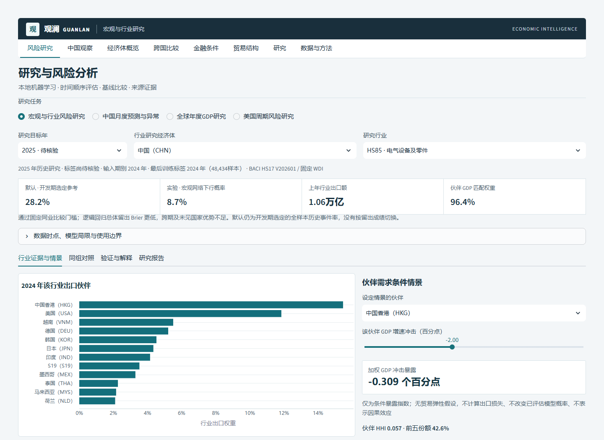
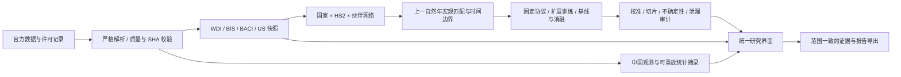

# 观澜 Guanlan · Economic Intelligence

**宏观数据、双边贸易网络与可复核 AI 研究的一体化工作台。**

本项目把全球宏观研究与中国官方月度数据观察整合为同一个系统，并加入真正运行的本地机器学习、国家—行业出口下行研究、伙伴暴露情景、来源证据审计和可离线阅读的报告导出。面向研究人员、国际业务分析人员和需要理解模型局限的人工智能学习者。

定位是**有严格评估记录的研究原型**。数据是当前修订历史快照；模型并未证明可以按当时发布日期实时实施。页面把开发期预定参考、实验模型、失败年度和强对照一起展示，不把聊天生成当作模型训练，不把研究概率当作投资建议。



当前属于开发阶段的专业研究平台；私有仓库发布与 CI 通过均不等同于金融机构生产部署认证。功能验收继续以真实研究工作流、证据和模型局限为准。

## 从一个问题到一份可核查报告

以“中国 HS85 电气设备行业”为例：

1. 在 **AI研究 → 宏观与行业风险研究** 选择经济体和 HS2 行业。
2. 查看上一年出口规模、伙伴权重、HHI、前五伙伴份额、GDP 匹配覆盖和缺失输入。
3. 比较开发期选定参考、宏观网络模型、逻辑回归与仅贸易消融；进入验证页查看逐年、国家、行业切片及可靠性图。
4. 为一个伙伴设定 GDP 增速百分点冲击，查看行业出口权重加权的条件暴露指数。
5. 导出 HTML 研究报告、包含指纹与训练边界的 JSON 证据包、当前估计 CSV。报告范围始终与当前国家—行业选择一致。

情景指数没有贸易弹性假设，不计算推导的出口损失，也不改变已评估模型概率。当前无标签估计针对 **2025 年**，使用 2024 年输入；在本项目核验日期它属于待标签核验的历史研究估计，不能称为实时未来预测。

## 功能

| 工作区 | 能做什么 |
|---|---|
| AI研究 | 宏观×行业下行概率、伙伴暴露、校准、开发期置换解释；中国月度预测与异常核查；全球 GDP 回测；美国周期实验 |
| 中国观察 | 官方全国月度观测、口径与发布日期、覆盖和缺口、原文摘录重放核验 |
| 经济体概览／跨国比较 | WDI 14 指标、同地区／同收入组参照、严格同年比较、IMF 固定版预测 |
| 金融条件 | BIS 政策利率、信贷与有效汇率；来源隔离，单一快照失败不会阻断其他模块 |
| 贸易结构 | BACI 2017—2024 全年双边流的伙伴与 HS2 聚合，规模、集中度及出口 RCA |
| 研究／数据与方法 | 参数明确的研究证据包、CSV／JSON／HTML／Markdown 导出、版本、来源与局限 |

## 架构与工程能力



- `src/guanlan`：来源适配、事务快照、贸易与宏观分析、本地 AI、证据报告和 Streamlit 页面。
- `src/china_macro`：独立命名空间的中国官方数据解析、口径管理、重放审计与可选原有轻量网页。
- `scripts`：按来源刷新、官方 BACI 重建与导入、有限模型评估、泄漏审计、安全检查。
- `data/processed`：可离线使用的、附有 SHA256 元数据的数值快照。
- `data/network`：完整八年国家—HS2—伙伴网络及逐分区来源清单。
- `docs/validation`：实测评估、测试、安全扫描和浏览器验收证据。

刷新先构建并验证不可变快照，最后通过 SQLite 单次事务切换整批引用；失败保留此前活动数据。页面单次运行读取一致的引用，并按来源独立处理空数据、校验失败与重试。发布快照为经过同值核验的平面文件，运行后的新批次目录和本机数据库不纳入 Git。

## 数据、来源和发布范围

| 数据 | 固定快照范围 | 使用与处理 |
|---|---|---|
| World Bank WDI | 217 个经济体、14 项指标、2000—2025，缺失值保留 | 官方逐指标页面核查许可与来源；不填补目标标签 |
| CEPII BACI | HS17 V202601，2017—2024，89,207,221 条原始 HS6 双边流 | Etalab 2.0；`v` 千美元乘 1000；聚合为伙伴与 HS2；保留官方完整包 |
| BIS | 政策利率、信贷缺口、有效汇率及原始 ZIP | BIS 数据使用条件；中文标签为非官方译文 |
| IMF WEO | 固定 2026 年 4 月版，预测与历史明确区分 | 按统计数据专门条款归属；商业复用须另外核查；不用于 LLM 训练 |
| BLS／美联储理事会 | 6 条直接官方月度序列，2,644 条观测 | 从 BLS API、G.17、H.15 独立获取；公有领域统计数据，保留来源，排除标志和第三方图像 |
| 国家统计局／人民银行／财政部／商务部 | 2,225 条全国观测，342 份 HTML 统计摘录及数值 JSON | 去除网页程序、标志和版式；全部摘录重放与本机原件解析结果一致；逐条保留官方 URL |

完整 BACI 包为 794,583,540 字节，采用 **17 个至多 45 MiB 的普通 Git 字节块**纳入私有仓库。重建后 SHA256 为：

```text
16aaa22d3b000cc87744c2c28ac97ce44394c3adf315ec259451d5bb4fcae609
```

这是相同官方包的存储分块，不是抽样、裁剪或转换。2024 原始 CSV 已在包内完整包含，避免再次储存同一内容。默认页面使用已构建快照，**无需重新解压或重新训练**。

旧 FRED 数据及其衍生回测、未获再分发确认的 UN Comtrade 样本、完整中国网站原页、本机运行数据库／日志／迁移路径与任何凭据不进入发布目录；本机原件保留。默认刷新不获取 Comtrade，贸易功能使用完整 BACI。具体处置、文件指纹和原始许可链接见 [数据许可](docs/DATA_LICENSES.md)、[发布清单](docs/data-disposition.json)、[统计摘录指纹](docs/source-excerpt-manifest.json)。私有仓库不豁免来源条款，也不改变数据所有权。

## 行业风险 AI：协议与真实结果

协议在读取行业留出结果前固定，文件和指纹保留于 [SECTOR_RISK_PROTOCOL.md](docs/SECTOR_RISK_PROTOCOL.md)。**没有超参数搜索，也没有依据留出成绩更换标签、年份或特征。**

目标为：下一自然年该国 HS2 行业货物出口是否比上一年下降至少 10%。上一年出口至少 1,000 万美元，前两年行业有观测，伙伴 GDP 匹配权重至少 80%。仅当该出口国在目标年有贸易记录时建立标签；目标行业无流被标为“BACI 未报告流”、记 0，并明确报告数量，不能称经济真实零值。

原始 89,207,221 条流聚合后形成 153,994 条候选国家—行业年度记录；按固定规则保留 **56,527 条**，排除 97,467 条，涉及 217 个国家、96 个实际 HS2 章。排除规则可能同时命中，不能把各原因数简单相加。9 条合格标签记录的目标行业未报告流；5,674 条记录至少缺失一项本国宏观输入。

| 目标年 | 样本数 | 用途 |
|---|---:|---|
| 2019 | 7,938 | 初始训练 |
| 2020 | 7,954 | 初始训练 |
| 2021 | 7,846 | 开发验证，训练标签截至 2020 |
| 2022 | 8,158 | 开发验证，训练标签截至 2021 |
| 2023 | 8,290 | 固定留出，训练标签截至 2022 |
| 2024 | 8,248 | 固定留出，训练标签截至 2023 |
| 2025 | 8,093 | 无目标标签的历史研究估计，训练标签截至 2024 |

特征包括上一年规模、行业增速、HS2 类别、伙伴 HHI、前五份额、GDP 覆盖，以及按上一年行业出口权重匹配的伙伴 GDP 增速和本国 GDP／通胀／失业率／投资／经常账户。宏观匹配恰好上一自然年，不借相邻年；HS2 为类别，不当作连续章号。逻辑回归的填补和标准化只拟合训练集；树模型原生处理本国特征缺失。两类历史率基线采用固定 Beta 平滑。

有限比较包括全样本率、同业率、逻辑回归 `C=1`、100 次迭代的直方图梯度提升分类器，以及移除全部数值宏观特征的相同树消融。逐年扩展训练共 12 次，2022 地理排除诊断 1 次，无标签估计 3 次，总计 16 次拟合；解释复用 2022 开发模型。

**2023—2024 完全相同的 16,538 行留出结果：**

| 固定方法 | Brier ↓ | 对数损失 ↓ | ROC-AUC ↑ | 平均精确率 ↑ |
|---|---:|---:|---:|---:|
| 全样本历史率 | 0.231341 | 0.658102 | 0.465082 | 0.326255 |
| 同业历史率 | 0.228003 | 0.652954 | 0.571743 | 0.400054 |
| **逻辑回归对照** | **0.219586** | **0.632790** | **0.630855** | **0.451619** |
| 宏观×网络树模型 | 0.220493 | 0.634561 | 0.610880 | 0.436518 |
| 仅贸易与集中度消融 | 0.221144 | 0.639819 | 0.630217 | 0.458056 |

**强对照与稳定性限制是主要结论：**逻辑回归总体 Brier 更低；2024 年消融 Brier 0.200520，低于宏观网络模型 0.205812；开发期主模型 0.227577，差于全样本率 0.159533；47 个未见国家的 2022 开发诊断中，主模型 0.189347，差于同业率 0.160087。宏观变量没有显示稳定、全面的增益。

主模型在两个留出年均比同业率 Brier 更低，按出口国整组抽样 2,000 次的模型减基线差值 95% 区间为 `[-0.011901, -0.003707]`，因此仅通过该**预先固定的同业比较门槛**。这不表示领先所有强对照、地理迁移通过或达到可部署标准。

页面默认参考依据 2021—2022 开发期预定规则选为**全样本历史事件率**；未按留出结果更换赢家。所有模型概率均显示为研究估计，概率未用留出数据重校准。固定 10 个等宽分箱展示可靠性，全部国家／行业切片保留，小样本不计算 AUC；置换解释只用 2022 开发样本，不称因果。

[真实评估 JSON](docs/validation/sector-risk.json) · [逐年回测 CSV](docs/validation/sector-risk.csv) · [真实数据泄漏审计](docs/validation/sector-leakage-audit.json)

## 其他 AI 模块的验收结论

- **全球 GDP**：WDI 直方图梯度提升，开发 2015—2019、历史留出 2020—2024。1,033 条留出中主模型 MAE 4.816，上一年值 6.390，但五年中位数 **4.652 更好**。2020 年及经验带覆盖门槛失败；90% 经验带实际覆盖约 65.2%。补充对照是已查看历史期的有限重检，2025 额外历史年不能替代失败门槛。
- **中国月度**：七个指标、岭回归、自然月滞后 1／2／3／12、末 12 个月逐期扩展留出，比较上期值与去年同月值。七项均未通过固定门槛，默认参考取开发期选定基线。IsolationForest 对最新一期评分，最新一期不参与训练；没有异常标签，不能宣称检测准确率。
- **美国周期**：直接官方数据，三状态高斯混合、六个月标签隔离，295 个评估月。模型 Brier 0.237862，训练事件率基线 0.218742，未通过；默认展示基线，实验概率主动展开。没有使用旧 FRED 内容重命名或继续训练。
- **可选 DeepSeek**：基于用户可见的少量公共观测生成带白名单引用的摘要，输出须通过结构与引用校验。默认关闭，所有验收只用 mock，**未进行实际付费调用**。没有把 IMF 内容用于 LLM 训练。

## 安装与离线启动

建议 Python **3.11**，工作盘至少 2 GiB 可用空间；完整数据重建另需至少 8 GiB。代码与数据使用私有 GitHub 仓库，克隆需要已有 LRZer 授权。默认启动不连接外部服务。

Windows PowerShell：

```powershell
git clone https://github.com/LRZer/economic-intelligence.git
cd economic-intelligence
py -3.11 -m venv .venv
.\.venv\Scripts\python.exe -m pip install -r requirements.lock.txt
.\.venv\Scripts\python.exe -m pip install --no-deps --no-build-isolation -e .
.\.venv\Scripts\python.exe -m pip check
.\.venv\Scripts\python.exe -m streamlit run app.py --server.address 127.0.0.1 --server.port 8610 --browser.gatherUsageStats false
```

Linux/macOS：

```bash
python3.11 -m venv .venv
.venv/bin/python -m pip install -r requirements.lock.txt
.venv/bin/python -m pip install --no-deps --no-build-isolation -e .
.venv/bin/python -m pip check
.venv/bin/python -m streamlit run app.py --server.address 127.0.0.1 --server.port 8610 --browser.gatherUsageStats false
```

打开 `http://127.0.0.1:8610`。Windows D 盘实际验收使用独立 `.venv`，不继承系统 site-packages；全部固定版本在锁文件，模型结果记录 Python 和关键包版本。CI 执行基础测试与小 fixture，不自动重跑 89M 原始流。

在空间紧张的 Windows 机器，安装前只为当前进程设置任务缓存位置，例如：

```powershell
New-Item -ItemType Directory -Force D:\research-artifacts\temp,D:\research-artifacts\pip-cache
$env:TEMP='D:\research-artifacts\temp'
$env:TMP=$env:TEMP
$env:PIP_CACHE_DIR='D:\research-artifacts\pip-cache'
```

不要直接跨盘搬动 `.venv`；复制项目后重新创建虚拟环境。

## 配置

`.env.example` 提供无秘密示例，**不会自动加载源项目的 `.env`**。默认不需要任何 API key。配置通过进程环境或本机 `.streamlit/secrets.toml` 注入，秘密文件已忽略。

```dotenv
ENABLE_PAID_AI=0
DEEPSEEK_API_KEY=
DEEPSEEK_MODEL=deepseek-chat
AUTO_REFRESH=0
# CHINA_DATA_DIR=/your/local/runtime/china
```

只有主动将 `ENABLE_PAID_AI` 设为 `1`、在本机安全配置凭据并点击生成按钮，才会请求付费服务。金额由服务商决定；本项目不提供免费额度承诺。数据刷新也须主动执行，不在页面启动时采集。

## 复现数据、评估和报告

以下用 `python` 表示已激活的独立环境；Windows 可替换成 `.\.venv\Scripts\python.exe`。

```bash
# 从仓库中的17块重建官方完整包，逐块和整体核对SHA。
python scripts/reconstruct_baci.py

# 全8年伙伴/HS2聚合：需要足够磁盘与内存；不会更改原ZIP。
python scripts/import_baci.py --zip data/raw/BACI_HS17_V202601.zip

# 固定宏观×行业协议：先读现有WDI快照，不隐式刷新标签或追分。
python scripts/build_sector_research.py --zip data/raw/BACI_HS17_V202601.zip --temporary /your/task-temp

# 不重新拟合，核对真实特征、标签、训练范围与未来宏观扰动。
python scripts/audit_sector_research.py

# 其他固定实验；写入本机reports，不覆盖已发布docs/validation证据。
python scripts/benchmark_china.py
python scripts/benchmark_global.py
python scripts/benchmark_references.py

# 如需更新来源，主动运行。更新数据会改变指纹，必须重新评估。
python scripts/refresh_data.py --macro-only
python scripts/refresh_data.py --us-only
python scripts/refresh_bis.py
```

完整包解压逐年进行，网络构建把每年的任务临时 CSV 清理掉；不修改原项目或原始包。模型采用固定种子，CPU 并行、平台及依赖差异仍可能造成浮点末位差异。再现应首先核对协议、数据 SHA、同样本范围与年份，再比较指标容差；不能拿新的修订快照冒充原实验。

若要运行中国原有轻量网页，可执行 `python -m china_macro.app`；主系统不依赖它独立运行。中国数据从随包数值材料初始化到独立本机运行目录。累积值、同比、环比、指数不可直接混用；口径变更与缺口在界面标注。

## 测试、质量与安全

```bash
python -m pytest -q
python -m ruff check src scripts tests app.py
python -m mypy
python -m bandit -r src -ll
python -m pip_audit
python -m build --no-isolation
node --test tests/china/test_chart_model.js
node --check src/china_macro/web/app.js
```

`mypy` 覆盖预测、行业网络、分类评估、报告与行业 UI 核心；Ruff 当前规则验证语法和关键未定义变量类错误，**不等于全部风格规则审查**。Bandit 中高风险必须为零；完整扫描的低风险项逐项记录，不能误称全部零告警。依赖扫描记录执行日期，只代表当次漏洞数据库。

关键测试包含：真实解析约定、币值单位、自然年／月边界、重复键、来源哈希破坏、缺失宏观不借相邻年、未来数据扰动、训练标签截止、同样本基线、无重叠地理诊断、情景边界、报告转义／范围、付费请求 mock、事务失败回滚、UI 空／异常／重复操作。

本机浏览器验收使用已安装 Edge 的独立 headless 进程：先启动 8610 服务，再运行 `python scripts/browser_acceptance.py`；它检查七个页面/任务、实际图表、重复导航、移动端溢出、页面异常和默认付费请求为零，保存截图。CI 使用小 fixture 和已有轻量快照，不下载 BACI 原包、不重新跑巨大实验、不请求付费接口。最终通过／未运行项、命令与证据见 [验收记录](docs/ACCEPTANCE.md)。

## 局限与下一步验证条件

1. 数据修订与首次发布日期未解决；当前回测只能验证统计期别顺序，不能证明当时可获得。
2. BACI 仅货物，HS2 聚合隐藏 HS6 差异、公司与价格/数量变化；未报告流与真实零出口不可等同。
3. GDP 权重是上一年行业出口暴露，不能识别伙伴需求的因果效应；概率输出也不是贸易损失预测。
4. 可用性与规模筛选会改变国家/行业构成；所有切片和过滤规则保留，但没有代表性保证。
5. 疫情、政策与结构冲击下稳定性不足；逻辑回归和贸易消融揭示主模型未全面领先。
6. 国家整组抽样保留一国内行业相关性，但未完全处理跨国网络依赖；短时间跨度限制不确定性解释。
7. 无标签的 2025 估计需用独立官方目标数据核验；未来研究应先冻结新的协议与未查看的数据版本。
8. 付费摘要只提供证据辅助，不能替代人工核对；来源许可、接口可用性和数据修订需持续复查。

项目不声称学术首次创新、生产可用或可盈利。它展示的是：可审计数据工程、真实的有限机器学习实验、可靠的对照与泄漏边界、明确失败结论，以及研究人员能实际使用的证据工作流。
