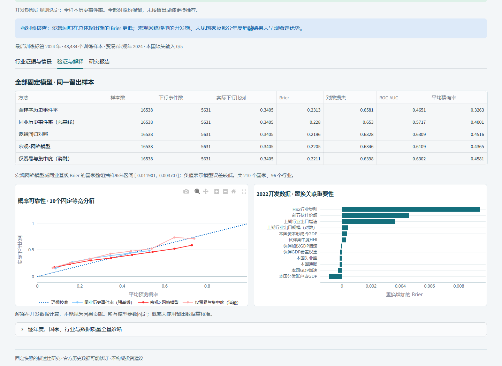
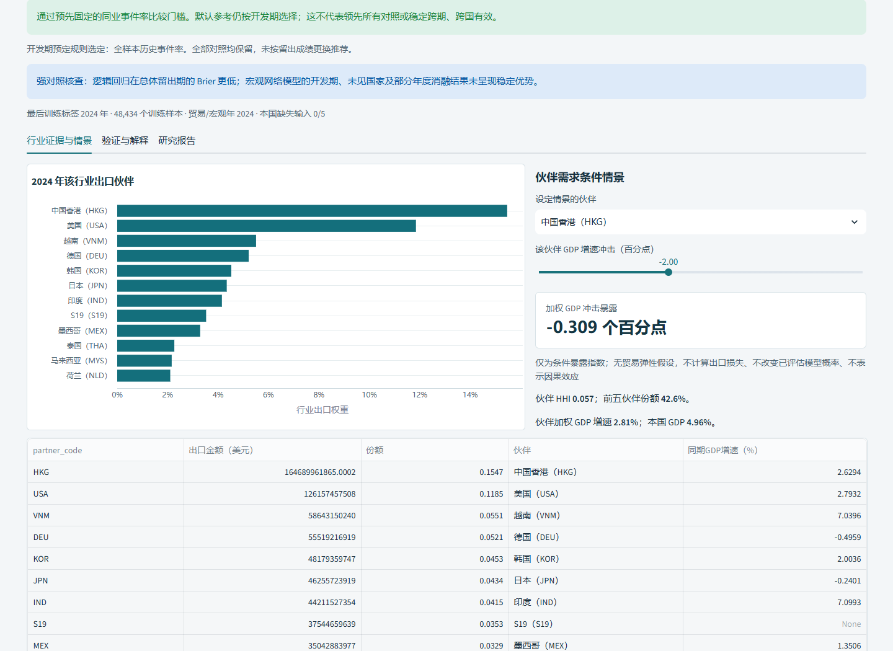

# 观澜整合系统验收记录

本记录依据实际执行日志、数据指纹和浏览器下载，状态截至 **2026-10-04 UTC**。本地功能及视觉增强已通过以下检查；研究功能验收提交 `01c4960cc4edaed957ce6a2fa09ec5df4fd8c195` 已发布到授权私有仓库，对应 [CI 37197991379](https://github.com/LRZer/economic-intelligence/actions/runs/37197991379) 全部步骤成功。远端1010个文件对象的SHA、大小及模式逐个匹配本地提交。本文记录该功能提交；随后证据整理提交保持代码和README不变，交付时另核对仓库HEAD及其CI。

## 交付范围与原项目保护

- 全新独立整合项目，保留全球研究和中国观察能力，加入国家—HS2 行业出口下行研究、中国月度预测与异常核查、全球 GDP 回测、美国周期实验。
- 新项目、独立环境、工具缓存和回滚副本均位于获准的 D 盘目录。原项目的 Git HEAD 和工作区状态与最初记录一致；原有未提交修改保留。见 [源项目核对](validation/source-preservation.json)。
- 详尽 [README](../README.md)、方法说明、来源许可、发布数据清单、固定协议、模型逐期结果、真实截图和离线报告均随项目提供。
- [机器可读验收摘要](validation/acceptance-summary.json)；运行日志中的个人本地路径已替换为占位符，未复制源项目 `.env`、凭据、个人运行数据库或整个原网页。

## 最终检查结果

| 检查 | 实际结果 | 证据与范围 |
|---|---|---|
| Python 全量测试 | **168 passed，10 subtests passed，188.43 秒**；最终下载修复后14项专项测试通过 | [日志](validation/final-tests.log)、[JUnit XML](validation/final-tests.xml)；合并后的全部测试目录 |
| Ruff | 通过 | [日志](validation/lint-final.log)；`E9/F63/F7/F82` 规则，不表示全风格检查 |
| mypy | 通过，6 个核心文件 | [日志](validation/typecheck-final.log)；预测、行业网络、研究对照、风险模型、报告、行业 UI，不宣称全仓库类型覆盖 |
| 独立依赖环境 | Python 3.11.7，固定依赖安装，`pip check` 通过 | [日志](validation/pip-check-final.log)；不继承系统 site-packages |
| 前端脚本 | Node 测试与语法检查通过 | [测试日志](validation/javascript-tests.log)；`node --check` 成功时无输出 |
| Bandit 中高风险门槛 | 中风险 0，高风险 0 | [门槛日志](validation/bandit-threshold.log)、[全量扫描](validation/bandit-final.json)；低风险 2 项已审阅，见下文 |
| pip-audit | 未发现已知依赖漏洞 | [JSON](validation/dependency-audit-final.json)、[日志](validation/dependency-audit-final.log)；本地项目不在 PyPI，依赖已扫描 |
| wheel / sdist 构建 | 通过；核对实际压缩包和独立安装导入 | [产物审计](validation/build-artifact-audit.json)；两种包精确包含 342 份统计摘录，没有旧 FRED 模块或凭据文件 |
| 中国源数据审计 | 数据库完整，2,225 条观察，640 个来源，错误/警告为 0 | [审计 JSON](validation/china-source-audit.json)；1873 条有日期、352 条缺发布日期；60 月覆盖 98.6%，24 月 99.3%，不能宣称日期完备 |
| 发布文件检查 | 扫描通过；覆盖已跟踪文件并再次核对历史与数据指纹 | [发布扫描](validation/publication-safety.json)、[数据文件 SHA256 清单](data-file-manifest.json)；检查 Git 跟踪文件、大小、凭据形状和个人路径 |

最后的测试、lint、类型检查、构建均成功退出。验收时仅保留本地预览服务；没有挂起的训练、安装、测试或构建命令。

Bandit 的两个低风险结果为 `china_macro/cny_trade.py` 的 `B404`（导入 subprocess）和 `B603`（curl 回退）。已核查 URL 来自严格允许范围，参数为列表，无 shell 拼接，TLS 校验开启，无 `-k`，有超时和响应大小限制，Windows 启动隐藏窗口。保留完整告警，不使用 `nosec` 隐藏；全量 Bandit 退出码为 1 是这两项低风险结果，`-ll` 的中高风险门槛退出码为 0。

## UI 与真实导出

本轮新增2023／2024历史留出和2025待核验年份切换、双向同组对照、特征同组分布、训练期发生率区间、伙伴证据核对，以及页签／重复下载状态修复。8个主导航在桌面和390px窄屏共16组实际巡检均无异常或页面水平溢出，截图已目视检查。美国HS85按2023→2024→2025→2023连续切换，同行对象数依次144／145／134／144；每轮实际下载HTML／JSON／CSV并核对年份、训练边界与报告范围。见[开发功能验收](DEVELOPMENT_ACCEPTANCE.md)、[年度场景](validation/research-scenario-browser.json)、[巡检结果](validation/visual-survey.json)、[下载修复测试](validation/download-state-tests.log)。

独立 headless Edge 访问本地应用，检查七个页面/任务：中国 AI、行业 AI、全球 AI、美国 AI、中国观察、经济体概览、贸易结构。各页面真实图表均加载；页面异常和浏览器脚本错误为 0，重复导航两轮通过。行业测试还覆盖切换国家、修改情景、往返任务、数据缺失、网络损坏、失败后继续导航。

移动端中国 AI、行业 AI 和离线报告的水平溢出均为 **0 px**。行业报告的 HTML、JSON、CSV 从应用实际下载，核对国家 `CHN`、行业 `HS85`、目标年 `2025`、按开发期选择的 `global_rate` 参考及训练截止。HTML 独立渲染通过，无可执行脚本。见 [浏览器结果](validation/browser-acceptance.json)、[真实离线报告](../assets/demo/CHN-HS85-2025.html)、[JSON 证据](../assets/demo/CHN-HS85-2025.json)、[CSV](../assets/demo/CHN-HS85-2025.csv)。

截图均来自实际本地应用或其导出报告；没有生成替代 UI 图片。其余截图位于 `assets/screenshots`。

## AI 验收：保留失败和强对照

行业任务使用 BACI 2017—2024 完整 8 年、89,207,221 条原始流。固定筛选后 56,527 条国家—行业年度样本；2023—2024 留出 16,538 条，2025 年 8,093 条未核验历史研究估计。宏观值和伙伴权重恰好取目标年减一，训练标签严格早于评估年；未来数据扰动不改变早期特征。网络分片和快照 SHA 已验证，国家排除无训练标签重叠。见 [真实数据审计](validation/sector-leakage-audit.json)、[固定协议及指纹](validation/protocol-freeze.json)。

| 固定留出方法 | Brier（越低越好） |
|---|---:|
| 全样本历史事件率 | 0.231341 |
| 同行业历史事件率 | 0.228003 |
| 逻辑回归 | **0.219586** |
| 宏观×网络树模型 | 0.220493 |
| 仅贸易与集中度消融 | 0.221144 |

主模型两年均优于同行事件率，按国家成组 2,000 次抽样的 Brier 差 95% 区间为 `[-0.011901, -0.003707]`，**仅通过预先固定的同行比较门槛**。逻辑回归整体更好；2024 年消融为 0.200520，优于主模型 0.205812；2022 开发内未见国家诊断主模型 0.189347，劣于同行基线 0.160087。不能称全面领先、跨国稳定或已达部署标准。默认参考仍依据开发期选择为全样本历史事件率，未按留出成绩替换赢家。

中国七个预测指标均未通过固定模型门槛。全球 GDP 主模型 MAE 4.816 虽优于上一年值 6.390，但五年中位数 4.652 更好，跨年和未见国家门槛失败，90% 区间覆盖约 65.2%。美国周期模型 Brier 0.237862，劣于事件率基线 0.218742。失败结论已在 README、UI 和完整评估文件中保留，实验估计与默认基线清楚区分。

研究针对修订历史快照，缺少首次公开版本；时序边界检查不能证明当时实时可得。行业 GDP 冲击是条件暴露，不推断出口损失或因果效应。DeepSeek 摘要默认关闭，本阶段助手API验证使用mock。此后用户本人触发过一次合成材料连通检查成功；这仅证明接口可达，不证明商业分析质量，密钥与本地回执不发布。

## 数据许可与打包核对

- WDI 逐指标许可、CEPII Etalab 2.0、BIS、IMF 统计数据条款、BLS 和美联储来源均有链接及本地证据；中国统计数值按来源归属保存。[许可说明](DATA_LICENSES.md)、[许可证据](license-evidence.json)。
- BACI 原包拆为 17 个 ≤45 MiB 的普通 Git 字节块，真实重组 SHA 为 `16aaa22d3b000cc87744c2c28ac97ce44394c3adf315ec259451d5bb4fcae609`，与 794,583,540 字节官方原包相同。2024 CSV 已在包内，避免重复存储。
- 342 份中国 HTML 均为去除程序、图片、导航和版式后的统计摘录；重放的每条解析结果与原页一致。包装审计发现并移出了残留完整原页，加入回归测试，最终 wheel 和 sdist 均核对为精确 342 份摘录。
- 旧 FRED/Comtrade 缓存、未获再分发确认的完整网页、个人路径、运行数据库和密钥不进入发布，原文件保留在本地归档。[数据处置表](data-disposition.json)、[摘录原始/新指纹](source-excerpt-manifest.json)。

构建后的 wheel 1,774,328 字节，SHA256 `f3f25294e65bc14512e084fa150a5eba457a7f91b554cca7d70fa680aac3b5a4`；sdist 1,081,622 字节，SHA256 `52e887ddd240bc6eabe42a092c22a4c34447731548518638711a5b4e1dfc7289`。wheel内58个Python源文件逐字节匹配最终工作区；sdist中的README和最终变更模块也已核对。安装包不携带 794 MB 原始贸易归档；完整研究数据在授权私有仓库中随源项目保存。

## 未运行、未完成与复现边界

| 项目 | 状态与原因 |
|---|---|
| GitHub 发布 | 最终功能版本和全部许可内数据已上传授权的 `LRZer/economic-intelligence`，可见性核验为private；正常追加提交，未覆盖旧仓库、未强推 |
| 已核验功能提交与CI | `01c4960cc4edaed957ce6a2fa09ec5df4fd8c195` 已核对远端，[CI 37197991379](https://github.com/LRZer/economic-intelligence/actions/runs/37197991379) 全部17步骤成功，包括最终代码的完整测试、Ruff、mypy、Node、安全／依赖审计和构建。见[发布证据](validation/github-publication.json) |
| Linux／macOS | Linux最终功能提交CI已成功执行依赖、完整测试和构建；未在Linux做浏览器桌面启动，macOS未实测 |
| 实际付费 LLM API | 用户本人已触发一次合成材料连通检查成功；助手未触发。本次月度核验阶段不新增付费请求；业务质量未真实评估 |
| 首次公开历史版本与实时预测 | 未具备；不能声称该快照无修订偏差或已验证实时表现 |
| UI覆盖边界 | 8导航×2屏宽巡检、7任务端到端、4轮年份与下载场景均通过；不声称所有浏览器、屏宽或全部国家行业逐一覆盖 |

在独立 Python 3.11 环境安装锁定依赖后，执行 README 中的测试命令、`scripts/audit_sector_research.py` 和启动命令。重算大贸易网络需先重组官方 ZIP，并保证至少 8 GiB 可用空间；日常使用已有验证快照即可，无需每次训练。复现时先对齐协议、软件版本、数据 SHA、筛选样本和时间划分，再比较数值容差。功能代码提交和对应CI已核对通过；证据整理后的最终仓库HEAD也在交付时独立核对，最新工作流记录可在仓库Actions查看。

## DeepSeek接口工程补充验收

原研究功能的冻结模型与指标保持；本轮修正可选摘要调用默认模型、显式禁用思考、错误脱敏、付费启用门槛和一次性本人触发入口。43项最终接口回归及含既有摘要UI的44项回归通过，8文件mypy和相关静态／前端／安全检查通过。[详细交接](DEEPSEEK_TEST.md)、[状态](validation/deepseek-regression-status.json)、[本轮安装包审计](validation/deepseek-build-artifact-audit.json)。此前的安装包指纹对应研究功能版本，本轮更新后的安装包见此新审计；真实API未由助手调用，mock不是实际服务验证。

## 月度证据约束研究补充验收

[本阶段实际验收](MONTHLY_REVIEW_ACCEPTANCE.md)记录29例工程任务、238项完整回归+10子测试、最后相关回归、实际桌面/窄屏及导出核验。原科学结论保持；新增受限编排没有真实LLM业务质量评估，不把工程断言冒充预测优势。
