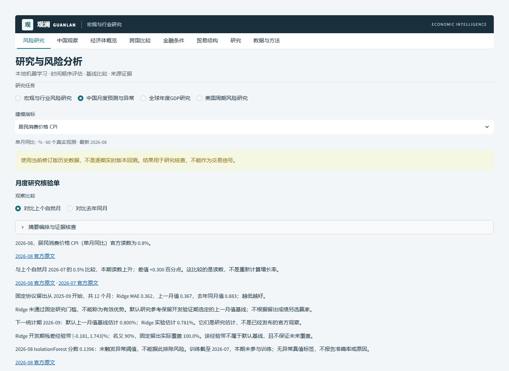
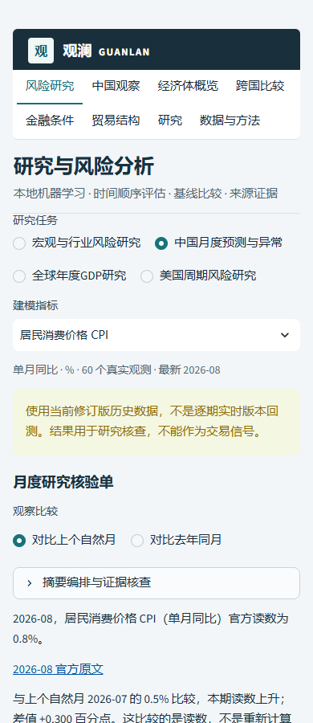
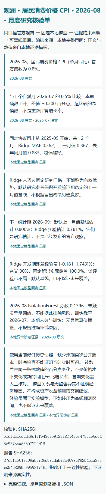

# 月度研究核验单：阶段一实际验收

本轮补齐“官方数据选择→实际本地AI分析→证据约束解释→核验导出”的中国月度研究流程，替换该页面可接受证据相反自由文字的摘要入口。外部编排只能选择已核验声明，默认离线，不生成新因果结论或交易建议。长期路线尚未完成，详见 [ROADMAP](../ROADMAP.md)。

## 已实现与实测

| 项目 | 实测结果 | 证据 |
|---|---|---|
| 预定工程任务 | 29/29通过：14真实快照流程、8不可信编排拒绝、7重新计算SHA的篡改拒绝 | [冻结协议](MONTHLY_REVIEW_PROTOCOL.md)、[任务记录](validation/monthly-review-scenarios.json) |
| 完整本地回归 | 238项+10子测试通过，0失败/错误/跳过；在功能实现后、最终HTML链接标签微调前运行 | [完整日志](validation/monthly-full-tests.log)、[XML](validation/monthly-full-tests.xml) |
| 最后相关回归 | 比较URL与范围提示后74项通过；最终HTML文本调整后新增功能38项再次通过 | [相关日志](validation/monthly-final-related-tests.log)、[最终月度日志](validation/monthly-final-tests.log) |
| 静态/前端/依赖 | Ruff、11文件mypy、pip check、Node测试/语法均通过；官方漏洞审计0已知漏洞 | [状态](validation/monthly-static-status.json)、[依赖审计](validation/monthly-dependency-audit.json) |
| 安全门槛 | Bandit中高风险0；原有2项低风险subprocess告警保留并已审核，未隐藏 | [完整告警](validation/monthly-bandit.json) |
| 实际浏览器 | 10场景通过；1440px桌面与390px窄屏，页面异常0、横向溢出0、付费API请求0 | [浏览器记录](validation/monthly-browser-acceptance.json) |
| 交互与导出 | 三指标往返、两种比较；合法计划导入、过期/越权回退、重复下载、手机JSON下载、离线HTML均通过 | [实际HTML](../assets/demo/monthly-review-cpi.html)、[JSON](../assets/demo/monthly-review-cpi.json)、[CSV](../assets/demo/monthly-review-cpi.csv) |
| 包构建与来源 | 最终wheel/sdist重新构建；源文件逐字节、342统计摘录SHA、独立安装及零网络核验导入检查 | [安装包审计](validation/monthly-build-artifact-audit.json) |

实际浏览器初次脚本在完整渲染结束前选择/下载，得到上一帧文件或错失控件；改为等待明确当前范围及Streamlit完成状态，再用真实键盘选择验证。产品增加导出范围说明，文件名及JSON自带指标/时期/比较/指纹。切换计算尚未结束时上一帧已生成报告仍可能存在，应核对当前报告范围；不把下载上一帧文件称为当前新结果。





截图来自最终实际应用/导出，已目视检查。完整指纹放在审计证据中，阅读页以清晰来源链接代替反复展示长ID。空数据、非法来源和错误后继续导航以AppTest验证，不声称每个异常都已在每款浏览器截屏。

## 可复现操作

使用README锁定环境，启动应用后选“风险研究→中国月度预测与异常”。七指标中选择一个，比较上个自然月或去年同月。下载JSON后执行：

```powershell
python scripts/verify_monthly_review.py path/to/monthly-review.json
python scripts/evaluate_monthly_review.py
python -m pytest -q
python -m ruff check src scripts tests app.py
python -m mypy
python scripts/browser_monthly_review.py
```

浏览器脚本要求本地应用在127.0.0.1:8610运行和已安装Edge；它没有API按钮、密钥输入或真实请求。其重复下载检查等待当前报告完成渲染。受限编排导入被拒绝时回到当前本地完整声明；方法决策和局限不可隐藏。

## 尚未达成与局限

- 29例属于已查看真实数据上的工程任务，不是自然语言事实准确率、预测泛化率或新的sealed业务评估；不能由29/29声称达到90%真实助手质量。
- 七个Ridge门槛仍全部失败，默认参考仍为原开发期选择基线。没有调参、改留出、引入新预测模型或修改固定数据；IsolationForest无异常真值标签。
- DeepSeek先前由用户本人触发的一次合成材料连通检查通过；那只验证连接。新增受限编排适配仅mock验证，未真实运行；本阶段没有追加付费预算或配置凭据。
- 缺少首次公开历史版本，读数与来源依赖可复算不代表当时可得；SHA不是数据真实性签名。核验需锁定依赖和浮点环境，不静默忽略跨版本差异。
- 未下载/运行时序基础模型，未建立通用检索助手、sealed应用评测或多跳贸易传导实验；下一阶段需独立冻结方案及费用授权。没有生产认证或在线部署。
- 私有仓库发布是本阶段最后核验步骤；以最终实际HEAD对应Actions及交付回执确认，不能拿旧提交CI代替本轮。
