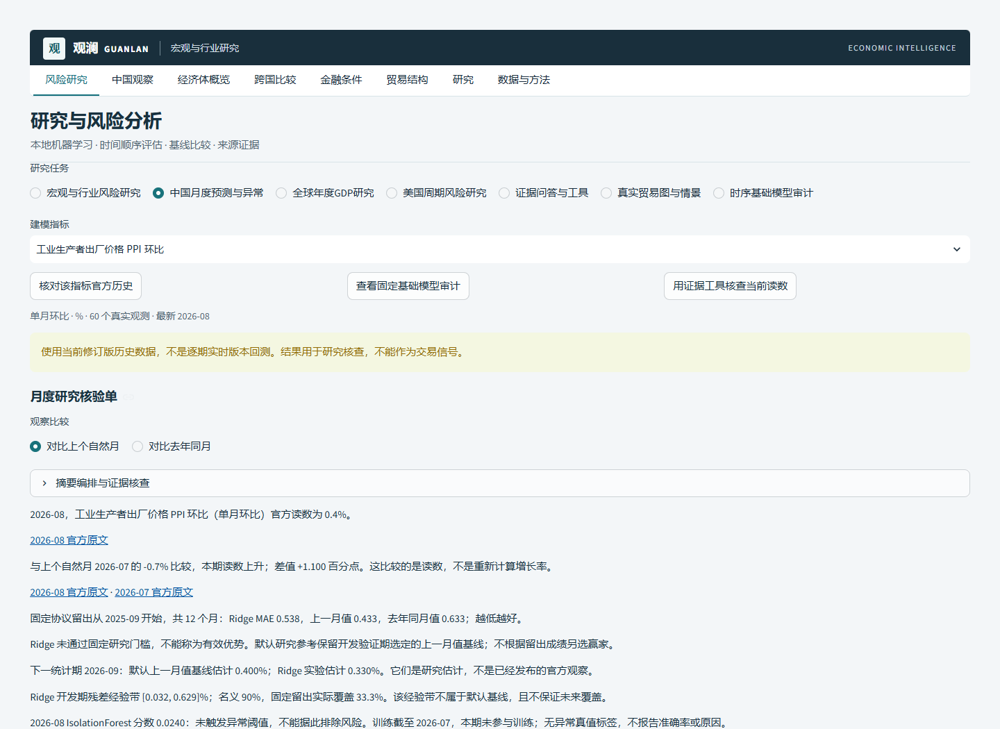
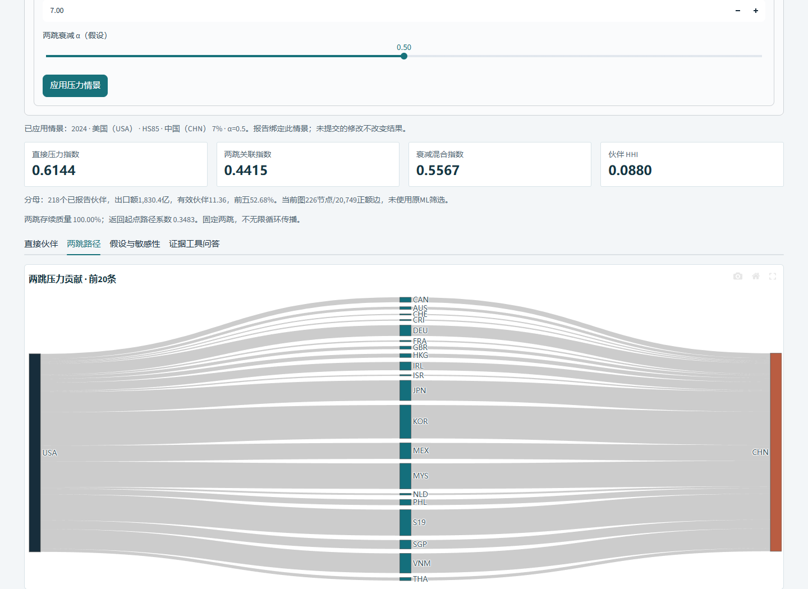

# 本轮总体工程验收与交付边界

本轮收口整套系统工作流、文档与验收；没有增加模型、调参、刷新数据、再运行Chronos或重测证据助手封存质量集。所有科学正负结果及原项目状态保留。以下为实际检查结果；远端准确提交与CI另由交付回执核对。

## 实际修复与跨模块验证

- 中国观察当前指标明确进入同指标月度研究，“本期观察”进入明确的月度任务。
- 月度研究带相同指标核对官方历史、固定基础模型审计或预填证据问题，最后问答须本人提交；冻结问答实现未改。
- 行业模型按输入年进入同国家/HS2真实图：目标2025→输入2024，返回目标2025。同对象压力情景和报告指纹保持，模型估计没有因图假设而改变。没有合格模型记录时图独立可用、跳转按钮禁用。
- `ENABLE_PAID_AI=0`时研究摘要不查找凭据；测试将任何配置读取设为错误，实际报告仍可使用。
- 发布审计默认只读，核对批准数据清单，不再重写它。只有显式私有检查及唯一冻结协议的精确SHA可放行历史工作目录路径，凭据检查从未豁免。

四项新工作流回归通过；新增LLM准备和只读安全检查共10项全部纳入最终全量，含预算/usage边界、假fixture不当作实测、哈希范围越界、首次顺序/失败停止、数字/引用篡改和JSONL秘密形状。

## 最终本机检查

| 检查 | 实际结果 |
|---|---|
| Python完整套件 | **359 passed、10 subtests passed、0失败、0跳过，327.79秒** |
| Ruff | src/scripts/tests/research/chronos/app.py通过；当前规则是语法/关键错误，不是全部风格审查 |
| mypy | **28文件**通过，包含新的上下文传递和LLM离线准备 |
| Node | 1个脚本测试通过、JS语法检查通过 |
| Bandit中高门槛 | src/scripts/research/chronos：Medium=0、High=0 |
| Bandit完整记录 | **219个LOW保留**：209个断言、4个subprocess导入、4个固定命令调用、1个Git路径查找、1个非加密病例随机。不是全部零告警；详见完整JSON |
| pip check | 无依赖冲突 |
| 应用依赖安全查询 | 91项无当次已知漏洞；1个未发布到PyPI的本地项目明确跳过，项目代码通过源码/测试核验 |
| 独立模型依赖查询 | 44项锁定CPU依赖无当次已知漏洞；只查询锁，不在应用导入/运行模型 |
| 科学冻结 | 13个助手文件、8个Chronos科学准备文件、40份唯一实测证据及实际执行源码核验通过 |
| LLM默认预检 | 12个冻结公开请求、6个本地拦截；真实调用0、凭据读取0、建议新上限$0.03尚未执行 |
| 源码与wheel构建 | 通过；README定稿后再构建，71个库Python文件、342统计摘录、4审计JSON逐项一致；独立安装离线复算通过、未导入Torch。具体SHA见[包核验](validation/overall-build-artifact-audit.json) |

全量源记录为 `reports/overall-final-checks/`；公开摘要在[总体检查](validation/overall-validation-status.json)、[应用依赖](validation/overall-app-dependency-audit.json)、[模型锁依赖](validation/overall-model-lock-dependency-audit.json)、[完整低风险告警](validation/overall-bandit-full.json)。没有使用匹配日志打印密钥或响应正文。查询只代表当次漏洞数据库，不是无漏洞担保。

## 实际浏览器与可离线实例

Microsoft Edge headless实际执行**23个场景**：两条跨模块链路、八个导航、七项风险任务、390px移动链路与无脚本离线HTML。1440px/390px页面异常0、浏览器付费请求0、整体溢出0；服务端另以禁用配置/测试阻止付费和凭据查找。这不代表所有国家/行业/设备组合逐一测试。

17张新截图及实际下载保存在[实例目录](../assets/demo/overall-workflows-v1/ppi-monthly.html)。本轮目视核查8张代表截图（桌面月度、两跳图、概览、跨国比较、研究报告、证据问答、移动月度、移动Chronos）；自动检查全部23场景。此前阶段截图与首轮失败记录未覆盖。

[同口径月度核验HTML](../assets/demo/overall-workflows-v1/ppi-monthly.html)、[JSON](../assets/demo/overall-workflows-v1/ppi-monthly.json)、[CSV](../assets/demo/overall-workflows-v1/ppi-monthly.csv)；[美国HS85情景HTML](../assets/demo/overall-workflows-v1/usa-graph.html)、[JSON](../assets/demo/overall-workflows-v1/usa-graph.json)、[完整路径CSV](../assets/demo/overall-workflows-v1/usa-graph.csv)。所有本轮下载JSON经原独立复算器核对；问答最新PPI环比0.4%，直接与官方批准快照比对。

重新验收浏览器前在本机8610启动关闭付费的应用，运行 `python scripts/browser_overall_workflows.py --output overall-browser-new-check`，用新目录保留每次结果。[23场景原记录](validation/overall-browser-acceptance.json)包含当时Windows源文件物理SHA；普通文本的跨平台行尾变化不等同于科学证据变化，科学冻结文件使用精确Git字节保留。

## 未运行、失败与不能推出的结论

真实LLM业务请求、专业研究员价值测试、首次发布vintage前瞻回测、Linux真实模型执行、生产部署/恢复/权限/性能验收均未运行。LLM源准备初期的工作目录错误、字符串语法及类型错误已在任何实际请求前修复；它们是工程准备勘误，不是成功业务结果。

Chronos仅一次Windows真实模型审计，普通产品不需要Torch。verifier只重算指标/基线，不独立证明模型执行；真实执行依赖日志、哈希、冻结代码。6/7胜开发参考不等于全面胜所有基线；80%原生区间实覆盖33.3%—91.7%未校准；配对区间跨零，研究门槛失败。其他AI失败及异常无金标签边界见[达成矩阵](OVERALL_ATTAINMENT.md)。本轮没有通过新实验掩盖这些结论。

两个原项目及既有未提交修改的状态指纹再次一致；已批准802个数据文件须在提交前及历史扫描再次核对。发布仅向已有批准私有仓库正常提交，远端HEAD、全树与对应CI在外部交付回执中保存；不借用上个提交CI。
