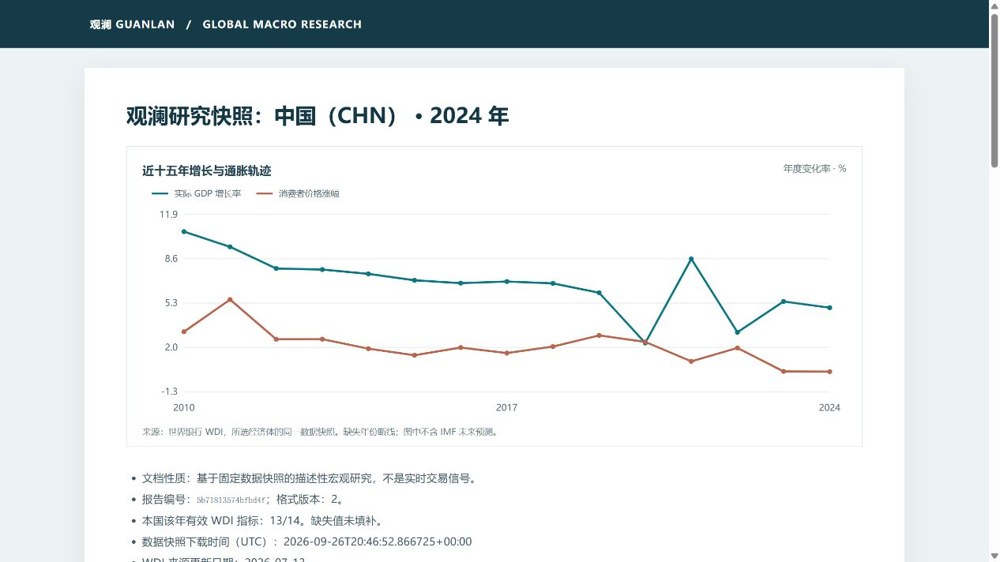

# 同组参照与研究报告：口径

## 数据范围

年度历史数据取自世界银行 WDI；IMF 中期预测来自固定的 WEO 2026 年 4 月版，作为独立前瞻数据集。贸易模块优先读取 CEPII BACI HS17 V202601 官方数据的伙伴与商品章聚合快照；BACI 未安装或校验失败时明确报告，不自动使用未获再分发确认的 Comtrade 样本。BIS 月度政策利率与季度私人非金融部门信贷/GDP 为单列的金融条件数据。已登记的快照校验失败或 BACI 两张表批次不匹配时停止生成报告，不自动换用另一来源。WDI 年度指标保留源数据中的空值。跨国参照和贸易摘要只读取所选的同一年，不用邻近年份补齐；BIS 只取所选年份内最后一期并标注实际观察月/季；IMF 未来预测与历史数据分开。详见[贸易方法](TRADE_METHODOLOGY.md)、[BIS 方法](BIS_METHODOLOGY.md)与[IMF 预测方法](WEO_METHODOLOGY.md)。

当前 WDI 快照包含 217 个经济体、14 项指标、2000—2025 年。新增经常账户余额、资本形成、实际利率和中央政府债务指标，为宏观与投资研究增加外部收支、实体投资、金融条件与财政背景。2024 年四项新增指标分别有 165、169、87、33 个经济体的有效数值；覆盖率会随官方刷新而变化，应以界面“数据与方法”页为准。

## 同组参照

可按“全球”“同地区”“同收入组”选择比较集合。地区和收入组采用 WDI 快照给出的国家分类；显示名称译为中文，但原始分类仍保留在数据中。集合总数包含该年没有所选指标观测值的经济体；统计分布只使用有效观测。

数值从高到低的名次为 `1 + 组内严格高于本国数值的经济体数`。中秩百分位为 `100 × (低于本国的数量 + 0.5 × 与本国相同的数量) / 有值经济体数`。并列值共享名次。百分位仅表示数值位置，不代表发展水平、经济质量或投资评分。有效覆盖不足一半时，界面与报告会提示选择偏差。

现价美元指标受汇率与物价影响；占 GDP 比例、增长率、价格和利率各有不同定义。指标字典在“数据与方法”页列出单位、定义、来源链接与跨国比较提醒。来源只提供当前版本和整体更新日期，本项目目前没有逐指标历史修订版本或逐项公布日，因此报告不是实时可得数据的回放。

## 可下载研究包

“研究报告”页按当前经济体、年份、参照指标及同组方式生成研究包，包括所有 WDI 年度指标的同年数值、组内覆盖与位置、可计算时的增长通胀状态、仅在同年存在时的贸易伙伴结构、BIS 年内最近月度与季度金融指标，以及单列的 IMF 2026/2027/2031 年预测附录。报告由确定性代码生成，不调用模型。WDI 数值是对应年份的当前发布版本，可能包含估计和后续修订；不能一律解释为未经修订的当期实测值。BIS 月度与季度不拼成“同日”观察，也不跨年借用数值。

ZIP 中的 `report.html` 可离线阅读和打印，含注明来源与缺失断线规则的十五年增长通胀图；`report.md` 便于版本比较。`data/` 保存本国指标、完整同组样本、图表年度底稿、同年出口伙伴、BIS 金融条件观察期与来源状态，以及单独标识的 IMF 预测。`manifest.json` 记录筛选条件、数据提供方、原始 BIS 包与快照 SHA-256、样本覆盖和包内每个文件的 SHA-256。报告编号由筛选条件、来源元数据和报告正文计算；同样输入产生相同编号与 ZIP 字节。HTML 样式修订会改变对应文件校验值。当前包格式为 **3**；格式 2 的旧包仍可核验并与新版比较。



也可从活动快照用命令行导出同一研究包：

```powershell
python scripts/export_research.py --country CHN --year 2024
```

默认写入被 Git 忽略的 `reports/`，文件名含报告编号。要完整重算，需保存相同项目版本及 `data/processed/` 快照；ZIP 的 CSV 是报告所用数据底稿，不含完整 WDI、BACI、BIS 或 WEO 原始数据。报告可核验当次输入和包内文件，不能重建上游数据库的历史公布状态。

## 数据版次比较

在“研究报告”页可上传同一经济体、年份、参照指标与同组方式的旧研究包，与当前活动快照生成的报告比较。系统先验证 ZIP 中所有文件的 SHA-256、报告编号和 CSV 主键，再展示各来源的版次/快照变化、WDI 指标原值差异、同组覆盖与名次、历史图表数据、同年出口伙伴、IMF 预测和 BIS 金融条件。BIS 仅在观察期和单位相同时计算数值差；旧版包原本未包含的金融指标标记为“新版新增资料”。数值差异按原单位计算；增长率、通胀率、利率及占比的差值是百分点。加入样本、移出样本、缺失转有值和有值转缺失分别标注。若只有报告文字或排版变化，可查看 Markdown 正文逐行差异。

命令行可导出摘要、完整逐项 CSV、正文差异和带输入文件 SHA-256 的比较清单：

```powershell
python scripts/compare_research.py reports/<旧研究包>.zip reports/<新研究包>.zip
```

比较需要两份历史研究包；仅保存最新活动快照无法还原已丢失的旧版数据。SHA-256 用于检查文件内部一致性，不能证明研究包由可信机构签发。若贸易数据提供方或统计口径不同，金额差值仅用于定位差异，不能直接解释为真实贸易增减；数据修订也不能直接当作经济在两个日期之间的变化。

可运行 `python -m pytest -q` 验证同年筛选、并列值、缺失保留与不跨年借用贸易样本等关键边界。
