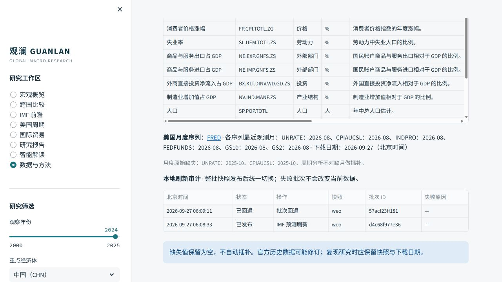

# 快照批次发布与回退

观澜将仓库随附的 `data/processed/*.parquet` 和同名 JSON 作为基础快照。刷新脚本在本地先写入 `data/processed/releases/<批次 ID>/`，校验每份 Parquet 的 SHA-256 和元数据，再用一次 SQLite 事务更新活动快照目录。页面每次运行只读取一次活动目录，因此同一页面不会混用刷新前后的批次引用。刷新中途失败时，当前活动快照保持原样，并记录失败事件；原始基础快照也不会被覆盖。

批次目录和 `release_catalog.sqlite` 是本地运行产物，不进入 Git。旧批次保留以供回退和审计；持续运行后应按机构的数据保留政策清理，当前版本尚无自动清理命令。仓库随附的基础快照仍可在没有本地目录数据库时直接使用。

## 操作

```powershell
python scripts/refresh_data.py --macro-only
python scripts/refresh_weo.py
python scripts/refresh_bis.py
python scripts/import_baci.py --zip data/raw/BACI_HS17_V202601.zip
python scripts/snapshot_admin.py list
python scripts/snapshot_admin.py rollback <完整批次 ID>
```

不加筛选运行 `refresh_data.py` 时，WDI、直接官方美国序列与周期回测会在全部构建成功后一次发布。`--us-only` 会把 BLS/Fed 直接官方序列和其回测结果作为同一批次。BACI 伙伴与商品章快照也同批发布。IMF WEO 为单快照批次。`refresh_bis.py` 默认将政策利率、信贷/GDP 与有效汇率三份快照同批发布，可用 `--policy-only`、`--credit-only` 或 `--eer-only` 单独刷新；原始 ZIP 的本地导入方法见 [BIS 方法](BIS_METHODOLOGY.md)与[有效汇率方法](EER_METHODOLOGY.md)。

回退只接受**当前仍完整生效**的已发布批次；若其中某份快照随后再次刷新，应先回退较新的批次。回退前程序校验目标旧快照及基础文件，随后一次事务恢复全部引用，并写入回退审计事件。回退不会删除任何数据文件。

页面的“数据与方法”工作区显示最近刷新事件。更完整的批次 ID 可用 `snapshot_admin.py list` 查看。测试覆盖来源阶段失败的审计、批次构建失败后的旧版保持、单文件校验及回退行为；外部 API 的可用性仍取决于数据提供方。


